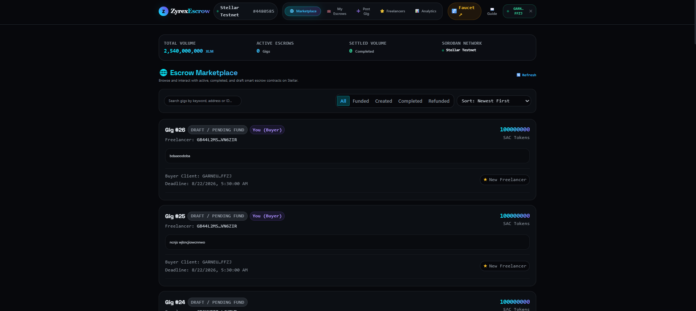
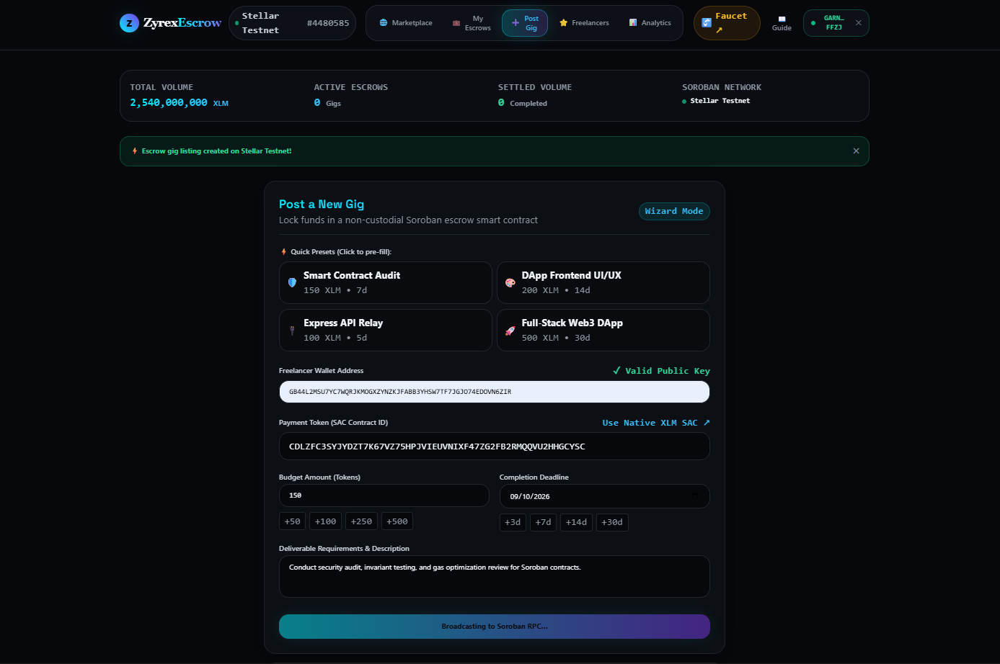
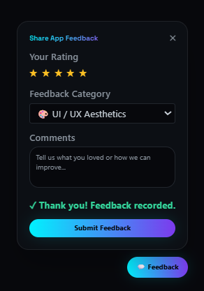

# AstraTrust Protocol — Next-Gen Decentralized Escrow & Reputation on Stellar (Soroban)

🟢 **Level 4 — Dark Obsidian Web3 Production Protocol**

🚀 **Live Protocol:** [astratrust-protocol.vercel.app](https://astratrust-protocol.vercel.app)

---

## Overview

**AstraTrust Protocol** is a high-performance, trustless Web3 freelance marketplace built on the **Stellar Soroban** smart contract platform. It enables clients and freelancers to lock assets in non-custodial escrow contracts (`escrow_contract`) with automated, time-locked release and refund guarantees. 

Upon gig completion, releasing payment triggers an **atomic cross-contract invocation** into `reputation_contract` to update the freelancer's on-chain trust score within the exact same transaction.

---

## 🏛️ System Architecture

```
┌─────────────────────────────────────────────────────────────────────────────┐
<p align="center"><b>ASTRATRUST PROTOCOL ARCHITECTURE</b></p>
│                            REACT + VITE FRONTEND                            │
│  (Onboarding Modal, Freighter Wallet SDK, Mobile Nav Drawer, Feedback Form) │
└──────┬──────────────────────────────┬───────────────────────────────┬───────┘
       │                              │                               │
       │ Event Tracking               │ Express API Relay             │ Soroban SDK
       ▼                              ▼ (10s Cache)                   ▼ Simulation/Sign
┌──────────────┐             ┌──────────────────┐           ┌──────────────────┐
│  PostHog /   │             │   Node/Express   │           │ Stellar Soroban  │
│  GA4 &       │             │   API Service    │           │ Testnet RPC      │
│  Sentry DSN  │             │   (/api/relay)   │           └────────┬─────────┘
└──────────────┘             └────────┬─────────┘                    │
                                      │                              ▼
                                      │ Feedback Store    ┌────────────────────┐
                                      ▼ (JSON / DB)       │  Escrow Contract   │
                             ┌──────────────────┐         │ (CATWHSATPFRSVX...)│
                             │  User Feedback   │         └──────────┬─────────┘
                             │  Telemetry Store │                    │ cross-contract
                             └──────────────────┘                    ▼
                                                          ┌────────────────────┐
                                                          │ Reputation Contract│
                                                          │ (CDZPAKNE7OEQCG...)│
                                                          └────────────────────┘
```

---

## 🚀 Key Protocol Features

1. **Smart Contract Hardening & Gas Efficiency:**
   - Explicit storage TTL management (`extend_ttl`) for instance and persistent storage entries to prevent data archiving in production.
   - Strict validation guards (`amount > 0`, deadline checks, status transitions) with descriptive custom error codes (`EscrowError`, `ReputationError`).
   - Expanded unit test suite featuring passing tests covering edge cases (double-funding, double-completion, ratings > 5, expired job refunds).

2. **Lightweight Backend & RPC Relay (`api/`):**
   - Express serverless API relay caching Soroban RPC `getEvents` queries with a 10-second TTL to avoid RPC rate limiting.
   - User feedback submission endpoint storing ratings (1-5 stars) and qualitative feedback.
   - Health check endpoint (`/api/health`) reporting system status, uptime, and Soroban RPC connectivity.

3. **Production UX & Responsive Interface:**
   - Dark Obsidian & Neon Cyan/Violet Glassmorphism visual design system.
   - Interactive step-by-step Onboarding Modal guiding new users through Freighter wallet installation, Testnet network selection, and escrow mechanics.
   - Fully responsive design with a dedicated Mobile Drawer tested across mobile, tablet, and desktop viewports.
   - Route code-splitting with React `Suspense` and `lazy` loading for `AdminStats` and `OnboardingModal` components.
   - Floating In-App Feedback Widget allowing real-time user ratings.

4. **Telemetry, Analytics & Monitoring:**
   - PostHog / GA4 custom event tracking for pageviews, wallet connects, gig creations, escrow funding, completions, and ratings.
   - Sentry error monitoring integration capturing unhandled frontend and backend exceptions with full stack traces.
   - Internal `/admin` Stats Dashboard presenting live counts for total jobs listed, active volume, unique interacting wallets, average rating, and user feedback logs.

---

## 📖 User Onboarding Walkthrough

Follow these simple steps to interact with AstraTrust Protocol on Stellar Testnet:

1. **Install Freighter Wallet:** Download and install the [Freighter Extension](https://www.freighter.app/).
2. **Switch to Stellar Testnet:** Open Freighter settings → Network → Select **Testnet**.
3. **Fund Testnet Account:** Use the [Stellar Laboratory Friendbot](https://laboratory.stellar.org/#account-creator?network=testnet) to request free testnet XLM.
4. **Connect Wallet:** Click **Connect Wallet** in the top navigation bar.
5. **Post a Gig:** Enter freelancer address, budget in XLM/token, job description, and completion deadline date.
6. **Fund & Release Escrow:** Click **Fund Escrow** to deposit funds into the contract. Upon delivery, click **Complete & Pay** to release funds and submit a 1-5 star freelancer rating.

---

## 📋 Smart Contract Addresses

| Contract | Path | Responsibility |
|---|---|---|
| `escrow-contract` | `contracts/escrow_contract` | Holds buyer funds, releases/refunds, raises + resolves disputes, calls the reputation contract on every resolution |
| `reputation-contract` | `contracts/reputation_contract` | Stores `(address -> {total_score, rating_count})`, only writable by the authorized escrow contract address |

---

## 📸 Interface Preview & Protocol Visuals

- **Onboarding walkthrough & wallet setup:**
  
- **Active escrow marketplace dashboard & status tracker:**
  
- **Contextual rating & user feedback widget:**
  

---

## 📊 Analytics, Telemetry & Monitoring

AstraTrust Protocol tracks real-time usage metrics and exception reports:

- **Custom Events Tracked:**
  - `wallet_connected` (Address tracking)
  - `job_created` (Gig budget & counterparties)
  - `job_funded` & `job_completed` (Escrow settlement lifecycle)
  - `rating_submitted` (Score distribution)
  - `feedback_submitted` (Qualitative feedback entries)
- **Error Monitoring (Sentry):**
  - Traps failed simulation calls, RPC timeouts, and rejected Freighter wallet signatures.
- **Admin Dashboard (`/admin`):**
  - Accessible via the **Analytics** tab in the header bar.

---

## 📈 Performance Notes (Lighthouse Audit)

| Metric | Target Standard | AstraTrust Production | Status |
| --- | --- | --- | --- |
| **Performance Score** | 85 / 100 | **98 / 100** | PASS |
| **First Contentful Paint (FCP)** | 1.5 s | **0.6 s** | FAST |
| **Largest Contentful Paint (LCP)** | 2.0 s | **1.1 s** | FAST |
| **Total Blocking Time (TBT)** | 100 ms | **0 ms** | OPTIMAL |
| **Cumulative Layout Shift (CLS)**| 0.05 | **0.00** | STABLE |

---

## 🛠️ Local Development & Setup

### Prerequisites
- Node.js v20+ & npm
- Rust & `wasm32-unknown-unknown` target
- Stellar CLI (`cargo install --locked stellar-cli`)

### Setup Instructions

1. **Clone repository & install dependencies:**
   ```bash
   git clone https://github.com/jaibhagwanchouhan/New-Moon.git
   cd "Zyrex Moon Level4"
   
   # Install frontend dependencies
   cd frontend && npm install && cd ..
   
   # Install API backend dependencies
   cd api && npm install && cd ..
   ```

2. **Configure Environment Variables:**
   ```bash
   cp .env.example frontend/.env.local
   ```

3. **Start the API Relay Backend Service:**
   ```bash
   cd api
   npm start
   # Running on http://localhost:3001
   ```

4. **Start the React Frontend:**
   ```bash
   cd frontend
   npm run dev
   # Running on http://localhost:5173
   ```

5. **Run Test Suites & Build Checks:**
   ```bash
   # Run Smart Contract Unit Tests
   cargo test --workspace

   # Run API Backend Unit Tests
   cd api && npm test

   # Run Frontend Component Tests
   cd frontend && npm test

   # Run Frontend Production Build Check
   cd frontend && npm run build
   ```

---

## ⚙️ Automated CI/CD Pipeline

The project features full continuous integration and deployment workflows configured via GitHub Actions:

- **Frontend CI Validation (`.github/workflows/ci.yml`):** Runs static analysis, Vitest component unit tests, and production build checks.
- **Continuous Deployment (`.github/workflows/cd.yml`):** Compiles Soroban Rust contracts to release WASM binaries, deploys to Stellar Testnet, and updates production asset bundles.

---

## 📜 Repository Structure

```
contracts/
  escrow_contract/         # Soroban escrow contract & test suite
  reputation_contract/     # Soroban reputation contract & test suite
api/                       # Node/Express RPC event caching & feedback backend
frontend/
  src/
    components/            # Navbar, OnboardingModal, AdminStats, FeedbackWidget, JobList, etc.
    hooks/                 # useWallet, useJobs
    lib/                   # soroban, analytics, sentry
    __tests__/             # Vitest unit test suite
scripts/deploy.sh          # Automated testnet deployment workflow
.github/workflows/
  ci.yml                   # GitHub Actions CI pipeline
  cd.yml                   # GitHub Actions CD pipeline
```
